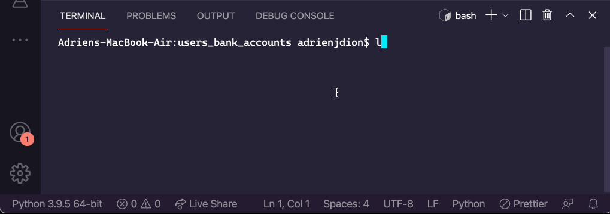

# Assignment: Users with Bank Accounts
**Welcome to another Core assignment!**

Some students like to explore the assignments before they're finished reading through the lessons, and that's okay! It can be good for your brain to have a preview of what your future challenges might be. However, before you begin this assignment, it's important that you've first:

- Completed the preceding lesson modules
- Taken the knowledge checks to confirm your understanding
- Viewed lecture material related to the assignment topics
- Completed and submitted your practice assignments

## Now, the Assignment:
Create a `User` class that has an association with the `BankAccount` class. You should not have to change anything in the `BankAccount` class.

For example, from the User class we should be able to deposit money into the user's account:
```
class User:
    def __init__(self, name, email):
        self.name = name
        self.email = email
        self.account = BankAccount(int_rate=0.02, balance=0)
    
    # other methods
    
    def make_deposit(self, amount):
    	# your code here
```

But our `User` class does not have a `self.account_balance` attribute. What it does have is an instance of a BankAccount by the name of `self.account`. That means that we'll be mirroring the methods created in the `BankAccount` class like make_deposit (and other methods referencing self.account_balance). But we'll be calling on the `BankAccount` class to do most of the work! That's the goal of this assignment, and you may find that you do not have to add much logic if any.

Remember in our User methods, we can now access the `BankAccount` class through our `self.account` attribute, like so:
```
class User:
    def example_method(self):
        self.account.deposit(100)		# we can call the BankAccount instance's methods
    	print(self.account.balance)		# or access its attributes
```

### Example Display for Sensei bonus



## Requirements:
- Create a User class with an __init__ method

- Add a make_deposit method to the User class that calls on its bank account's instance methods.

- Add a make_withdrawal method to the User class that calls on its bank account's instance methods.

- Add a display_user_balance method to the User class that displays user's account balance

- **SENSEI BONUS:** Allow a user to have multiple accounts; update methods so the user has to specify which account they are withdrawing or depositing to

- **SENPAI BONUS:** Add a transfer_money(self, amount, other_user) method to the user class that takes an amount and a different User instance, and transfers money from the user's account into another user's account.

