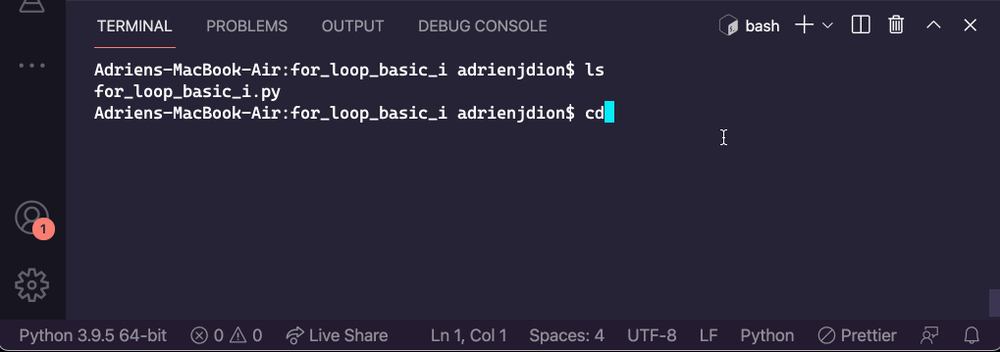

# Assignment: For Loops: Basic I
**Welcome to your first Core assignment of Python!** Some students like to explore the assignments before they're finished reading through the lessons, and that's okay! It can be good for your brain to have a preview of what your future challenges might be. However, before you begin this assignment, it's important that you've first:

- Completed the preceding lesson modules
- Taken the knowledge checks to confirm your understanding
- Viewed lecture material related to the assignment topics
- Completed and submitted your practice assignments

## Now, for the Core Assignment:
Create a Python file called for_loop_basic1.py that performs the following tasks.

1. - Basic - Print all integers from 0 to 150.
2. - Multiples of Five - Print all the multiples of 5 from 5 to 1,000
3. - Counting, the Dojo Way - Print integers 1 to 100. If divisible by 5, print "Coding" instead. If divisible by 10, print "Coding Dojo".
4. - Whoa. That Sucker's Huge - Add odd integers from 0 to 500,000, and print the final sum.
5. - Countdown by Fours - Print positive numbers starting at 2018, counting down by fours.
6. - Flexible Counter - Set three variables: lowNum, highNum, mult. Starting at lowNum and going through highNum, print only the integers that are a multiple of mult. For example, if lowNum=2, highNum=9, and mult=3, the loop should print 3, 6, 9 (on successive lines)

## Requirements:
- Create a Python file
- Basics
- Multiples of Five
- Counting, the Dojo Way
- Whoa. That Sucker's Huge
- Countdown by Fours
- Flexible Counter