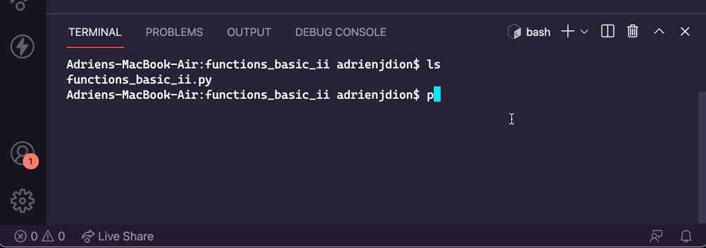

# Assignment: Functions Basic II

1. ### Countdown 
Create a function that accepts a number as an input. Return a new list that counts down by one, from the number (as the 0th element) down to 0 (as the last element).
- Example: countdown(5) should return [5,4,3,2,1,0]

2. ### Print and Return
Create a function that will receive a list with two numbers. Print the first value and return the second.
- Example: print_and_return([1,2]) should print 1 and return 2

3. ### First Plus Length 
Create a function that accepts a list and returns the sum of the first value in the list plus the list's length.
- Example: first_plus_length([1,2,3,4,5]) should return 6 (first value: 1 + length: 5)

4. ### Values Greater than Second 
Write a function that accepts a list and creates a new list containing only the values from the original list that are greater than its 2nd value. Print how many values this is and then return the new list. If the list has less than 2 elements, have the function return False
- Example: values_greater_than_second([5,2,3,2,1,4]) should print 3 and return [5,3,4]
- Example: values_greater_than_second([3]) should return False

5. ### This Length, That Value 
Write a function that accepts two integers as parameters: size and value. The function should create and return a list whose length is equal to the given size, and whose values are all the given value.
- Example: length_and_value(4,7) should return [7,7,7,7]
- Example: length_and_value(6,2) should return [2,2,2,2,2,2]

## Requirements:

- Countdown
- Print and Return
- First Plus Length
- Values Greater than Second
- This Length, That Value

