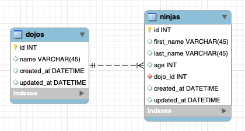

# Assignment: Dojos and Ninjas

**Welcome to another Core assignment!** Some students like to explore the assignments before they're finished reading through the lessons, and that's okay! It can be good for your brain to have a preview of what your future challenges might be. However, before you begin this assignment, it's important that you've first:

- Completed the preceding lesson modules
- Taken the knowledge checks to confirm your understanding
- Viewed lecture material related to the assignment topics
- Completed and submitted your practice assignments

## Now, the Assignment:
**Learning Objectives:**

- Students will create databases using the three types of relationships.
- Students will use SQL queries.

In the previous chapter, you created the dojos_and_ninjas_schema. Now, you'll get the chance to forward engineer this schema, and use queries to manipulate the database. Try to put yourself in the mindset of a software engineer working at Coding Dojo. In this role, you need to manage the data Coding Dojo has on their Dojo locations, and the Ninjas who take classes at each site.

If you get stuck on retrieving, changing, or deleting dojos and ninjas, be sure to apply the 20 minute rule! Try re-reading the previous modules and doing research on your own, then reaching out to your peers on Discord, and finally setting up some time with a Coding Dojo staff member so that you talk through the challenge you're facing.

## Reqirements:

- Forward engineer the dojos_and_ninjas_schema from the previous chapter
- Create a .txt file where you'll save each of your queries from below
- Query: Create 3 new dojos
- Query: Delete the 3 dojos you just created
- Query: Create 3 more dojos
- Query: Create 3 ninjas that belong to the first dojo
- Query: Create 3 ninjas that belong to the second dojo
- Query: Create 3 ninjas that belong to the third dojo
- Query: Retrieve all the ninjas from the first dojo
- Query: Retrieve all the ninjas from the last dojo
- Query: Retrieve the last ninja's dojo
- Query: Use a JOIN to retrieve the ninja with id 6 as well as the data from its dojo. Be sure to do this in one query using a join statement.
- Query: Use a JOIN to retrieve all the ninjas as well as that ninja's dojo, note, you will see repeated data on dojos as a dojo can have many ninjas!
- Submit your .txt file that contains all the queries you ran in the shell 