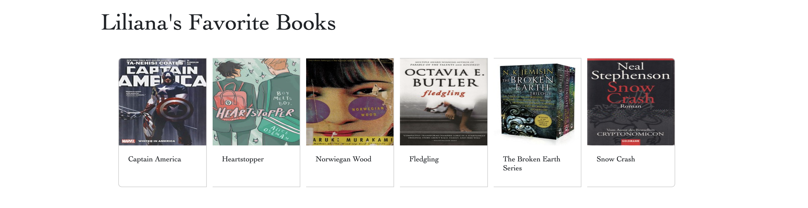
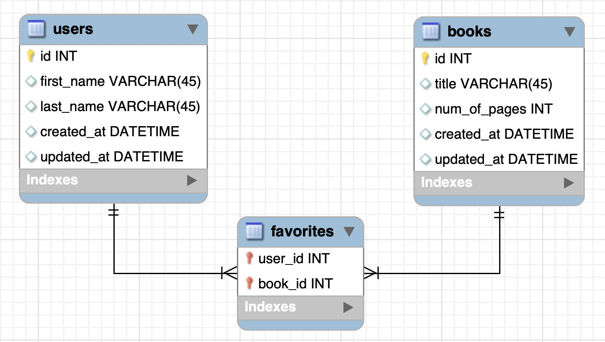

# Assignment: Books SQL
**Learning Objectives:**

- Create a database using a many-to-many relationship.
- Retrieve data from related tables using join statements.
- Use SQL queries to insert and update many-to-many relationships in a join table.

In the previous chapter, you created the books_schema. Now, you'll get the chance to forward engineer this schema, and use queries to manipulate the database. Imagine you're in charge of maintaining a database of users and books for an online book retailer. In this role, you need to manage the data that is displayed, including the books each user has favorited, as well as all the users that have favorited a particular book.

## Requirements:
- Forward engineer the books_schema from the previous chapter
- Create a .txt file where you'll save each of your queries from below
- Query: Create 5 different users: Jane Amsden, Emily Dixon, Theodore Dostoevsky, William Shapiro, Lao Xiu
- Query: Create 5 books with the following names: C Sharp, Java, Python, PHP, Ruby
- Query: Change the name of the C Sharp book to C#
- Query: Change the first name of the 4th user to Bill
- Query: Have the first user favorite the first 2 books
- Query: Have the second user favorite the first 3 books
- Query: Have the third user favorite the first 4 books
- Query: Have the fourth user favorite all the books
- Query: Retrieve all the users who favorited the 3rd book
- Query: Remove the first user of the 3rd book's favorites
- Query: Have the 5th user favorite the 2nd book
- Find all the books that the 3rd user favorited
- Query: Find all the users that favorited to the 5th book
- Submit your .txt file that contains all the queries you ran in the workbench

