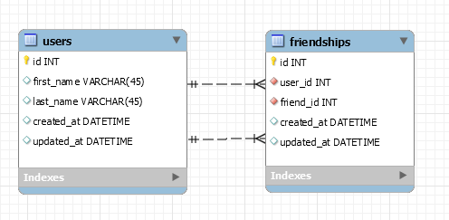

# Assignment: Friendships
**Learning Objectives:**
- Students will create databases.
- Students will use SQL queries and self joins.

In the previous chapter, you created the friendships_schema. Now, you'll get the chance to forward engineer this schema, and use queries to manipulate the database. Imagine you're in charge of maintaining the database of a new social networking site! In this role, you need to manage the data that is displayed, including who users consider their "friends" online.


After adding users to the database and creating some relationships, your results should look like below:
```
first_name	last_name	friend_first_name	friend_last_name
Amy	          Giver	            Eli	               Byers
Amy	          Giver	            Big	               Bird
Amy	          Giver	            Kermit	          The Frog
Eli	          Byers	            Kermit	          The Frog
Eli 	      Byers	            Marky	           Mark
Marky 	      Mark	            Big	               Bird
``` 
Your actual query will look something similar to this:
```
SELECT * FROM users 
JOIN friendships ON ____=____ 
LEFT JOIN users as user2 ON ____ = ____
```

Take note that we're joining the ***users*** table again but we're specifying the second ***users*** table **as** user2.  You can then reference the second ***users*** by calling user2 (e.g. user2.id, user2.first_name, etc).  

You can also rename the fields that are displayed on the result by using the **as** keyword, like the below example:   
```
SELECT user2.first_name as friend_first_name, user2.last_name as friend_last_name, ...  FROM ...
```
Knowing how to do joins can be tricky but is used quite often and will most likely appear again in your belt exam.

If you get stuck on selecting, joining, and retrieving users and friendships, be sure to apply the 20 minute rule! Try re-reading the previous modules and doing research on your own, then reaching out to your peers on Discord, and finally setting up some time with a Coding Dojo staff member so that you talk through the challenge you're facing.


## Requirements:
- Forward engineer the friendships_schema from the previous chapter
- Query: Create 6 new users
- Query: Have user 1 be friends with user 2, 4 and 6
- Query: Have user 2 be friends with user 1, 3 and 5
- Query: Have user 3 be friends with user 2 and 5
- Query: Have user 4 be friends with user 3
- Query: Have user 5 be friends with user 1 and 6
- Query: Have user 6 be friends with user 2 and 3
- Query: Display the relationships created as shown in the table in the above image
- NINJA Query: Return all users who are friends with the first user, make sure their names are displayed in results.
- NINJA Query: Return the count of all friendships
- NINJA Query: Find out who has the most friends and return the count of their friends.
- NINJA Query: Return the friends of the third user in alphabetical order 