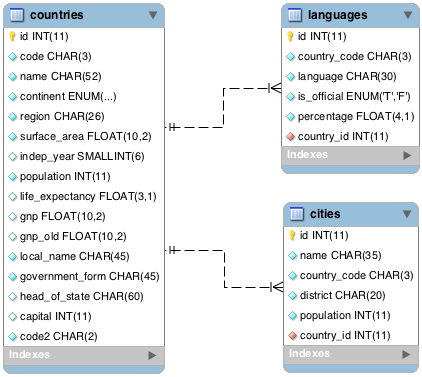

# MySQL Countries
**Learning Objectives:**
- Students will create databases using the three types of relationships.
- Students will use SQL queries.

If you were a developer working for an international organization, you might be tasked with maintaining a database of countries, including their cities and their many languages. In a role like that, you would need to be comfortable querying for specific populations, governmental structures, life expectancies, and more! With this sort of role in mind:

Using the world database and the pictured ERD, complete all 8 of the below queries.

First grab the ***world*** database (see world.sql file)

If possible, work in groups and use MySQL Workbench to do the queries. We want you to get familiar with using MySQL workbench. The questions are of varying difficulty level. Do the easier ones first.

## Queries

1. What query would you run to get all the countries that speak Slovene? Your query should return the name of the country, language and language percentage. Your query should arrange the result by language percentage in descending order. (1)

2. What query would you run to display the total number of cities for each country? Your query should return the name of the country and the total number of cities. Your query should arrange the result by the number of cities in descending order. (3)

3. What query would you run to get all the cities in Mexico with a population of greater than 500,000? Your query should arrange the result by population in descending order. (1)

4. What query would you run to get all languages in each country with a percentage greater than 89%? Your query should arrange the result by percentage in descending order. (1)

5. What query would you run to get all the countries with Surface Area below 501 and Population greater than 100,000? (2)

6. What query would you run to get countries with only Constitutional Monarchy governments, with a capital greater than 200 and a life expectancy greater than 75 years? (1)

7. What query would you run to get all the cities of Argentina inside the Buenos Aires district and have the population greater than 500, 000? The query should return the Country Name, City Name, District and Population. (2)

8. What query would you run to summarize the number of countries in each region? The query should display the name of the region and the number of countries. Also, the query should arrange the result by the number of countries in descending order. (2)

Note: You may download this PDF file displaying the expected results from the queries - [Expect Results (World)](https://assets.codingdojo.com/boomyeah2015/codingdojo/curriculum/content/chapter/mysql_countries_expected_output.pdf) 

## Requirements:
- What query would you run to get all the countries that speak Slovene? Your query should return the name of the country, language and language percentage. Your query should arrange the result by language percentage in descending order. (1)
- What query would you run to display the total number of cities for each country? Your query should return the name of the country and the total number of cities. Your query should arrange the result by the number of cities in descending order. (3)
- What query would you run to get all the cities in Mexico with a population of greater than 500,000? Your query should arrange the result by population in descending order. (1)
- What query would you run to get all languages in each country with a percentage greater than 89%? Your query should arrange the result by percentage in descending order. (1)
- What query would you run to get all the countries with Surface Area below 501 and Population greater than 100,000? (2)
- What query would you run to get countries with only Constitutional Monarchy with a capital greater than 200 and a life expectancy greater than 75 years? (1)
- What query would you run to get all the cities of Argentina inside the Buenos Aires district and have the population greater than 500, 000? The query should return the Country Name, City Name, District and Population. (2)
- What query would you run to summarize the number of countries in each region? The query should display the name of the region and the number of countries. Also, the query should arrange the result by the number of countries in descending order. (2)