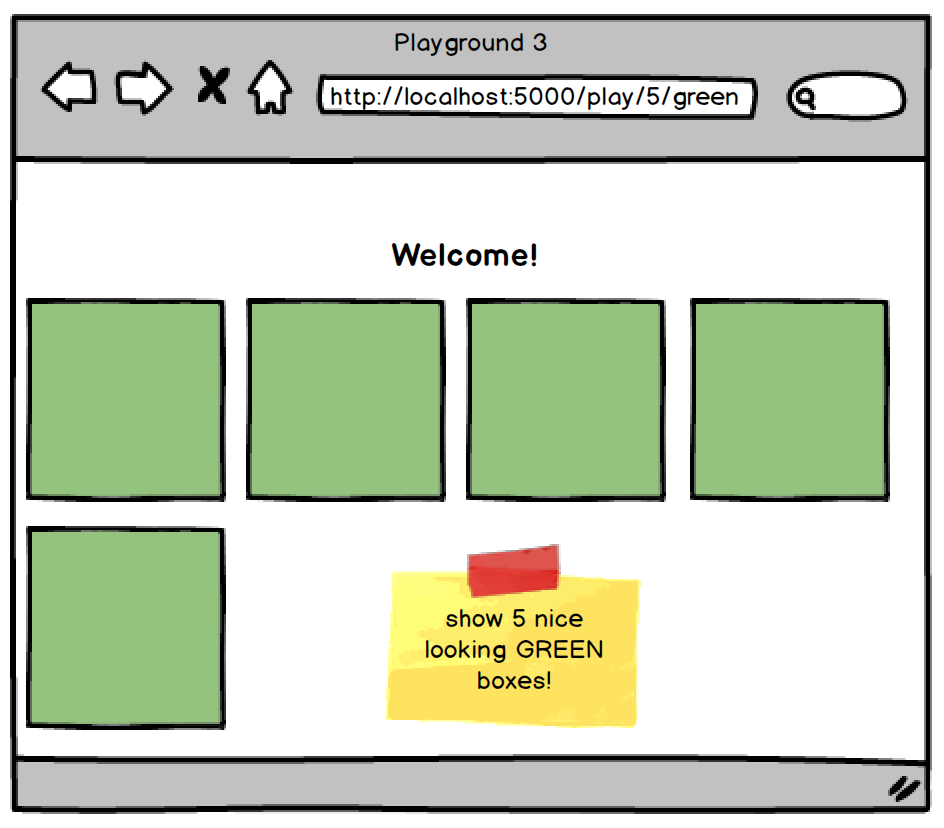

# Assignment: Playground

Welcome to another Core assignment! Some students like to explore the assignments before they're finished reading through the lessons, and that's okay! It can be good for your brain to have a preview of what your future challenges might be. However, before you begin this assignment, it's important that you've first:

- Completed the preceding lesson modules
- Taken the knowledge checks to confirm your understanding
- Viewed lecture material related to the assignment topics
- Completed and submitted your practice assignments

## Now, the Assignment:

## Internal Styling
Just for this assignment, use an internal stylesheet or inline CSS ([review here](https://www.w3schools.com/css/css_howto.asp)).

## Level 1
When a user visits **http://localhost:5000/play**, have it render three beautiful looking blue boxes. Please use a template to render this. 

## Level 2
When a user visits **localhost:5000/play/(x)**, have it display the beautiful looking blue boxes x times. For example, localhost:5000/play/7 should display these blue boxes 7 times. Calling localhost:5000/play/35 would display these blue boxes 35 times. Please remember that x originally is a string, and if you want to use it as an integer, you must first convert it to integer using int(). For example int("7") returns 7.

## Level 3
When a user visits **localhost:5000/play/(x)/(color)**, have it display beautiful looking boxes x times, but this time where the boxes appear in (color). For example, localhost:5000/play/5/green would display 5 beautiful green boxes. Calling localhost:5000/play/35/red would display 35 beautiful red boxes.

## Requirements:

- Create a new Flask project
- Have the /play route render a template with 3 blue boxes
- Have the /play/<x> route render a template with x number of blue boxes
- Have the /play/<x>/<color> route render a template with x number of boxes the color of the provided value
- NINJA BONUS: Use only one template for the whole project

