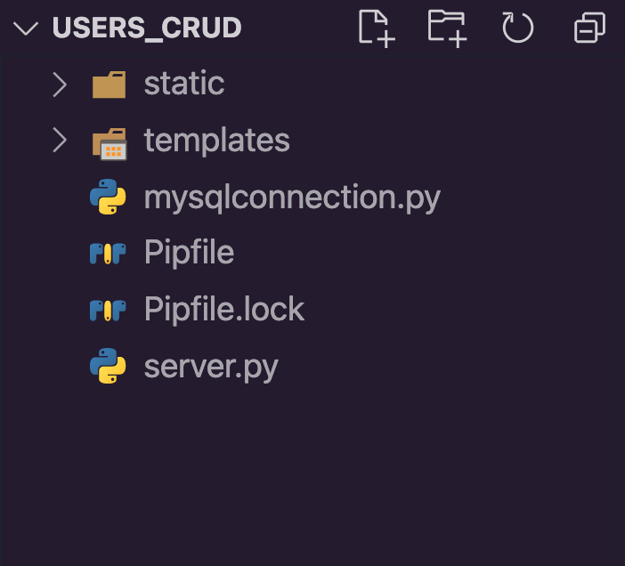
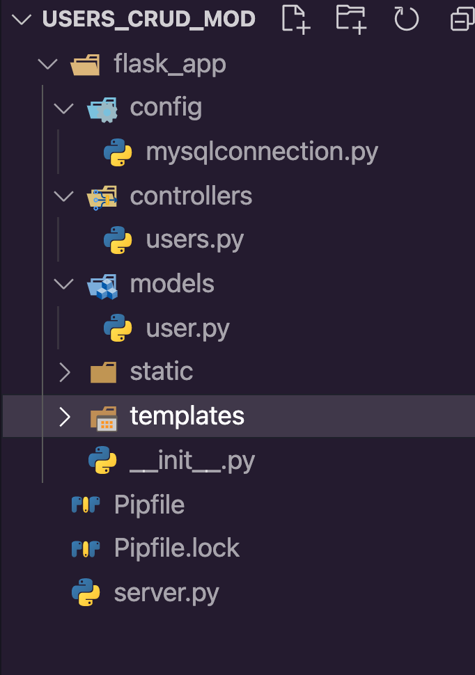

# Users CRUD Modularized

**Welcome to another Core assignment!** Some students like to explore the assignments before they're finished reading through the lessons, and that's okay! It can be good for your brain to have a preview of what your future challenges might be. However, before you begin this assignment, it's important that you've first:

- Completed the preceding lesson modules
- Taken the knowledge checks to confirm your understanding
- Viewed lecture material related to the assignment topics
- Completed and submitted your practice assignments

## Now, the Assignment:
**Learning Objectives:**

- Students will modularize a Flask app.

Take the previous assignment and modularize it to use the MVC pattern design.

## Requirements:

- Go through the steps of modularizing the Users CRUD assignment
- Zip up the modularized folder and submit it
