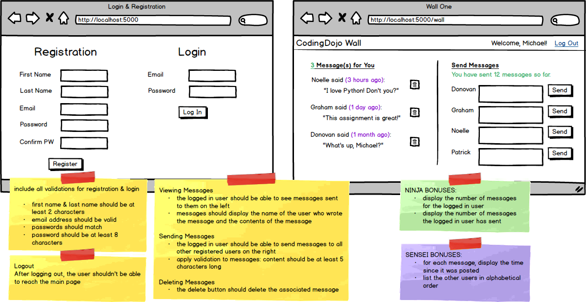
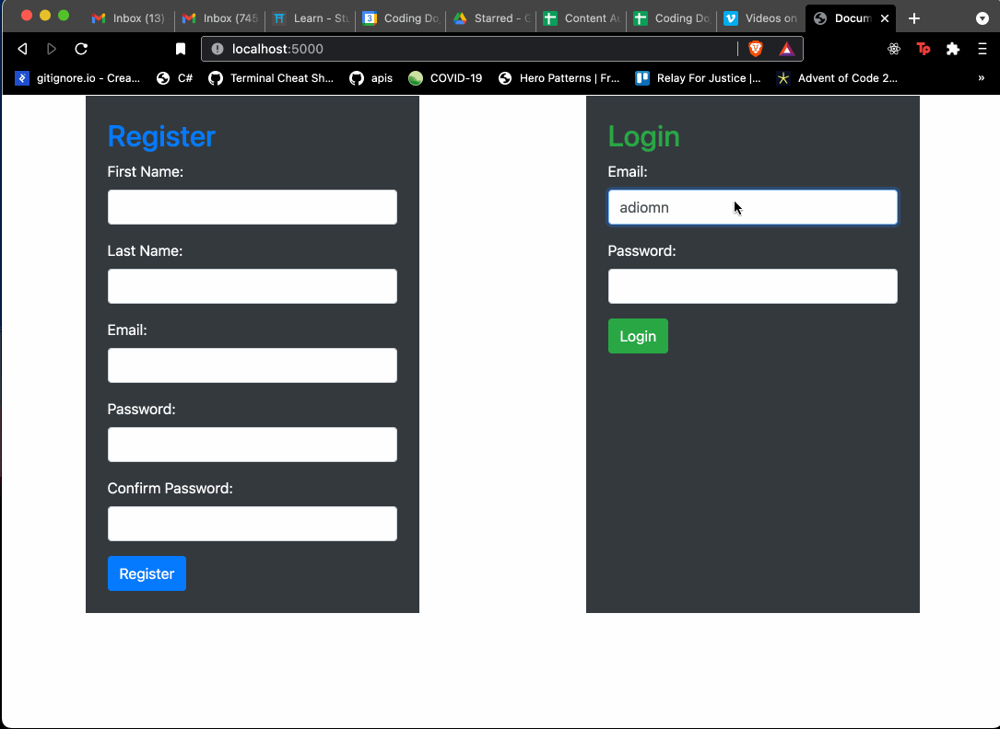
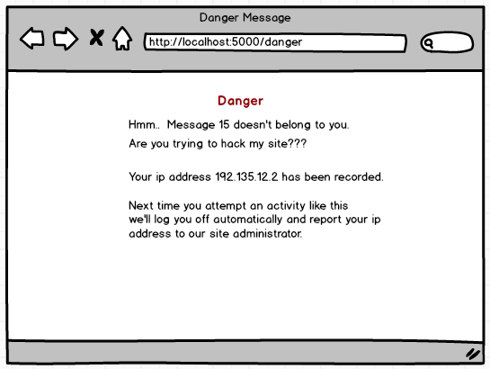

# Assignment: Private Wall (Optional)
**Learning Objectives:**

- Students will connect a Flask application to a MySQL database.
- Students will create login and registration within an app.
- Students will create self join relationships.
- Students will analyze the web security of their application.

For this assignment, a user's "wall" is a list of their private messages. Once a user has logged in, they can view their wall and, on this same page, the logged in user can also send messages to other users. The yellow sticky notes indicate basic functionality. Review the green sticky notes for Ninja Bonuses and purple sticky notes for Sensei Bonuses.

## Additional Sensei Bonus
For the delete functionality, do not allow someone to remove a message that doesn't belong to them. If someone tries to remove a message that doesn't belong to them, have your app display the following:

You don't really need to build the feature to report the IP address, but do log the user out if they try to remove a message that doesn't belong to them for the second time in a row. We'll leave it up to you to find out how to find the IP address of the user (a simple google search will show you how to do this in Flask).

## Requirements:

- Create a Flask application with Login and Registration and appropriate authentication
- Create a landing page that reflects the layout of the wireframe with clickable links and buttons (clickable prototype)
- Implement the 'send message' feature: On the landing page right side, display a 'send message' form for each of the other users
- Message creation: Implement all the appropriate methods to create messages in the DB that have both a sender and receiver associated
- Display a user's messages: implement and call a method to fetch all the messages sent to a particular user, and display the messages on the landing page.
- Display sender's name: Each message will include associated data of the user. Specifically, the sender's name should be displayed
- eleting messages: implement delete functionality for messages.
- Bonuses (Optional): Implement one to all of the Ninja and Sensei Bonuses!