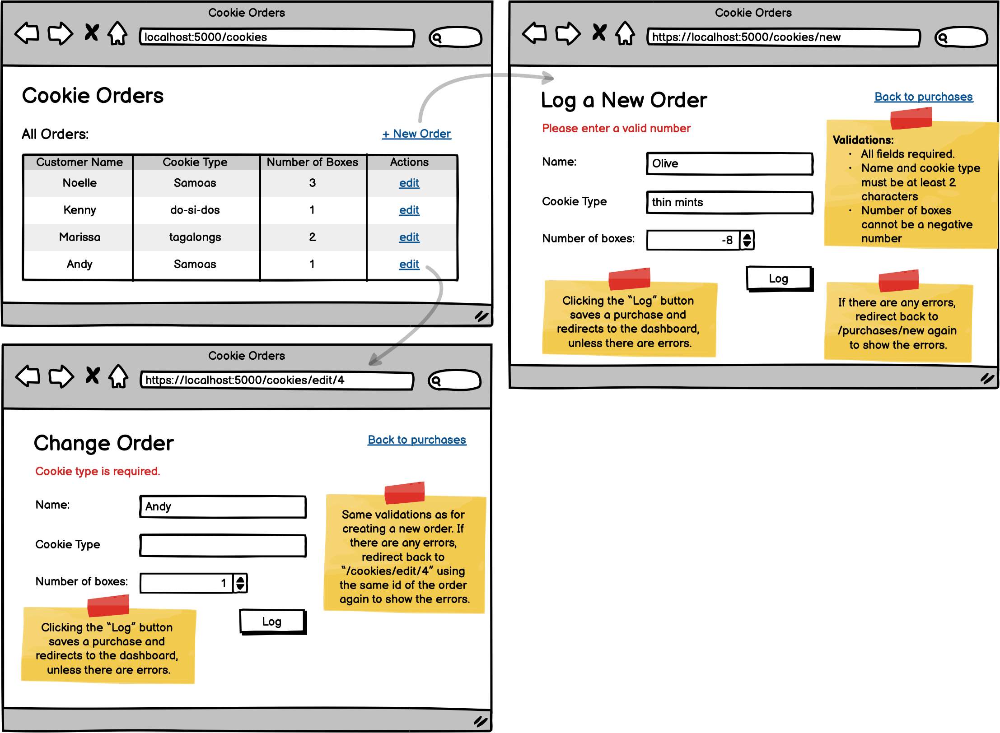

# Assignment: Cookie Orders with Validation
**Learning Objectives:**

- Build a modularized CRUD application with a database.
- Validate user input.
- Display error messages to the client using flash messages.
- Redirect to the same page to show errors on create as well as on edit.

Build out the following wireframe for helping girl scouts keep track of their cookie orders. You can save the wireframe image [here](https://assets.codingdojo.com/boomyeah2015/codingdojo/curriculum/content/chapter/1657228485__Cookie_Order_Validations.png).

Example click-through:

## Requirements:

- Create a new schema and table for cookie orders and forward engineer
- Set up a new modularized project, with crud functionality as shown above, be sure to test every feature before moving on to the next.
- Add validation to the create method: All fields are required, name and cookie_type must be at least 2 characters, number must be a positive number.
- Redirect and display any validation errors on the create page.
- Add validation to the edit page, same validations as for create.
- Redirect back to the edit page for that same order to show any errors.
- Pre-populate the edit fields with the existing record's values. 
