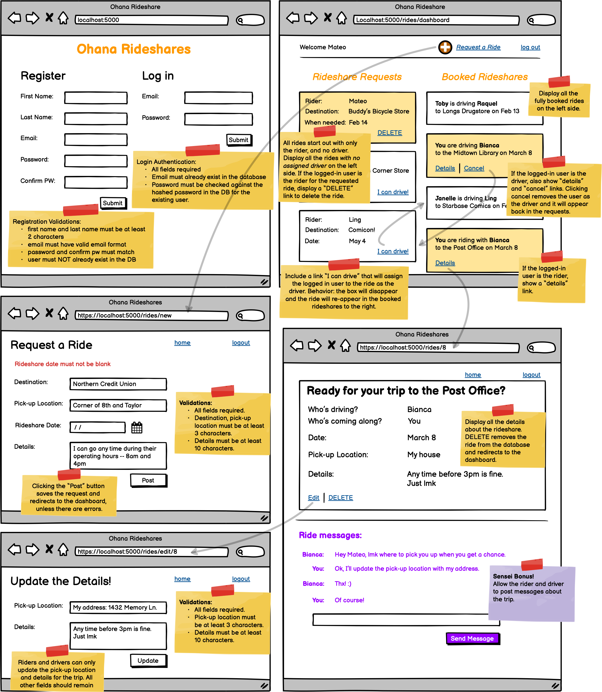

# Assignment: Ohana Rideshares
**Learning Objectives:**

- Students will review essential skills needed for the Belt Exam.

Click [here](https://assets.codingdojo.com/boomyeah2015/codingdojo/curriculum/content/chapter/1657843447__Ohana%20Rideshares.png) to open the wireframe image and save it locally.

 

## Requirements:

- Build out the wireframe above.
- Build an ERD based off of the information and functionality of the wireframe and create a schema in your database.
- Create a Flask application and use the MVC design pattern, and OOP to make the application functional.
- Carefully read and implement the features listed on the sticky notes. 