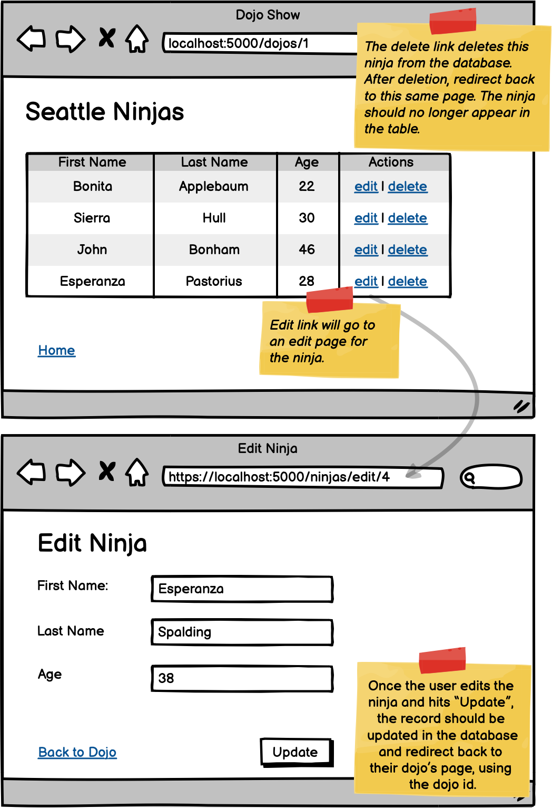

# Dojos and Ninjas CRUD Part 2
**Learning Objectives:**

- Update records in the database that belong to a one-to-many relationship
- Use path variables and/or hidden inputs to appropriately pass id data through requests to process updates
- Use path variables to pass an id to the server for deletion of a record when a user clicks a link
- Apply string concatenation or string interpolation (f-strings) to pass an id when redirecting to another server route with a path variable.

***Note: In the end of the video 'request.post' is mentioned, but what was intended was `request.form`***

**Welcome to another Core assignment!** Some students like to explore the assignments before they're finished reading through the lessons, and that's okay! It can be good for your brain to have a preview of what your future challenges might be. However, before you begin this assignment, it's important that you've first:

- Completed the preceding lesson modules
- Taken the knowledge checks to confirm your understanding
- Viewed lecture material related to the assignment topics
- Completed and submitted your practice assignments

## Now, the Assignment:
**Important:** Prior to this assignment, you must have completed the Dojos & Ninjas Part 1 assignment.

Let's add update and delete functionality to the Dojos and Ninjas assignment! In building this assignment you will also practice making anchor tags in your templates that use path variables, such as "dojos/1", as well as redirecting your server to other routes that take path variable values, like a dojo id.

**Pro Tip:** Be sure to test each individual feature before you move on to the next one. It may help to write down which feature you are working on and record any bugs you come across and how you solved it for later reference.

<!--  -->

## Requirements:

- Add a column to the ninjas table on the dojo details page that includes a delete and edit link for each ninja
- Add delete functionality to your Ninja model to be able to delete a record in the ninjas table.
- Add a route in your server that will process deleting a ninja and redirect to that same dojo details page e.g. "dojos/1"
- Create a template for editing a ninja
- Add edit functionality to your Dojo model to be able to update a record in the dojos table.
- Add a route to your server that will render the edit page with that particular dojo's info. Be sure to include 
1. pre-populated fields in the form and 
2. a link that goes back to that ninja's respective dojo's details page.
- Add an update POST route to process the user input from the edit form.
- Be sure to redirect to the dojo details page after processing the update.

