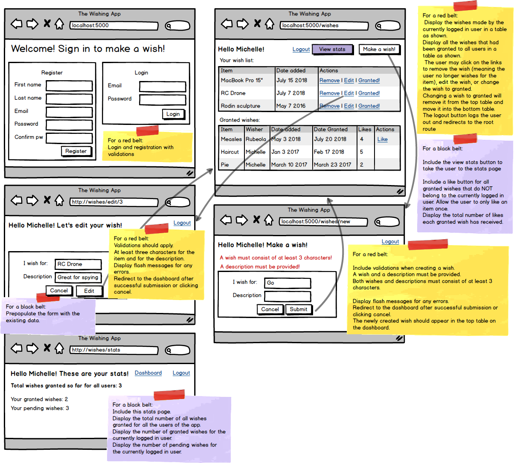

# WishApp - Python Full Stack

The WishApp is a simple web application where users can register, log in, and make wishes. Each wish includes an item and a description. Users can manage their wishes, mark them as granted, and view statistics on the wishes made by all users.



## Features
- User Registration and Login
Users can register by providing a first name, last name, email, password, and password confirmation.
- Login and registration are validated:
    - All required fields must be filled out.
    - Password confirmation must match.
- Flash messages are displayed for any validation errors.

## Dashboard
- The dashboard displays two main tables:
    - Your Wish List: Shows the list of wishes created by the currently logged-in user. Each entry displays:
        - Item name
        - Date added
        - Actions (Remove, Edit, and mark as Granted)
    - Granted Wishes: Shows all wishes that have been marked as granted by any user. Each entry includes:
        - Item name
        - Wisher’s name
        - Date granted
        - Number of likes
    - Users can like any granted wish, except their own.
- Users can edit or remove wishes from their list.

## Adding a Wish
- Users can make a new wish by providing:
    - Item name (at least 3 characters)
    - Description (at least 3 characters)
- The newly created wish appears in the user's wish list on the dashboard.
- Validation ensures both fields are filled out and meet character requirements. Flash messages display errors if validation fails.

## Editing a Wish
- Users can edit existing wishes, with the form pre-filled with current data.
- Validation is applied, ensuring each field contains at least 3 characters.
- Users are redirected to the dashboard upon successful editing or if they cancel the action.

## Stats Page
- The stats page provides the following information:
    - Total wishes granted for all users
    - The number of granted and pending wishes specifically for the currently logged-in user.

## Requirements
- **Python:** This project requires Python 3.x.
- **Flask:** The app is built using the Flask framework.
- **Database:** Use a database of your choice (MySQL) to store user data, wishes, and wish statuses.

## Installation
1. Clone the repository:
```
bash

git clone https://github.com/your-username/wishing-app.git
```

2. Navigate to the project directory:
```
bash

cd wishing-app
```

3. Install dependencies:
```
bash

pip install -r requirements.txt
```

4. Set up the database (instructions will depend on the specific database used).

## Usage
1. Run the application:
```
bash

python app.py
```

2. Open a web browser and go to http://localhost:5000 to access the Wishing App.

## Screens

### Registration & Login
- Register a new account or log in to access the app.

### Dashboard
- View, edit, remove, or mark your wishes as granted.
- Like other users' granted wishes.
- Navigate to the stats page or create a new wish.

### Wish Creation
- Create a new wish by providing an item and description (both with a minimum of 3 characters).

### Wish Editing
- Edit existing wishes with validation.

### Stats
- View total granted wishes and your own wish statistics.

## Validation and Error Handling
- Flash messages provide immediate feedback for form validations and errors.
- All actions are validated to ensure correct input and prevent unauthorized actions.

## Future Enhancements
- Improve the styling for a better user experience.
- Add filters or search features to browse granted wishes.
- Implement more detailed statistics and analysis features.

## License
This project is licensed under the MIT License.

